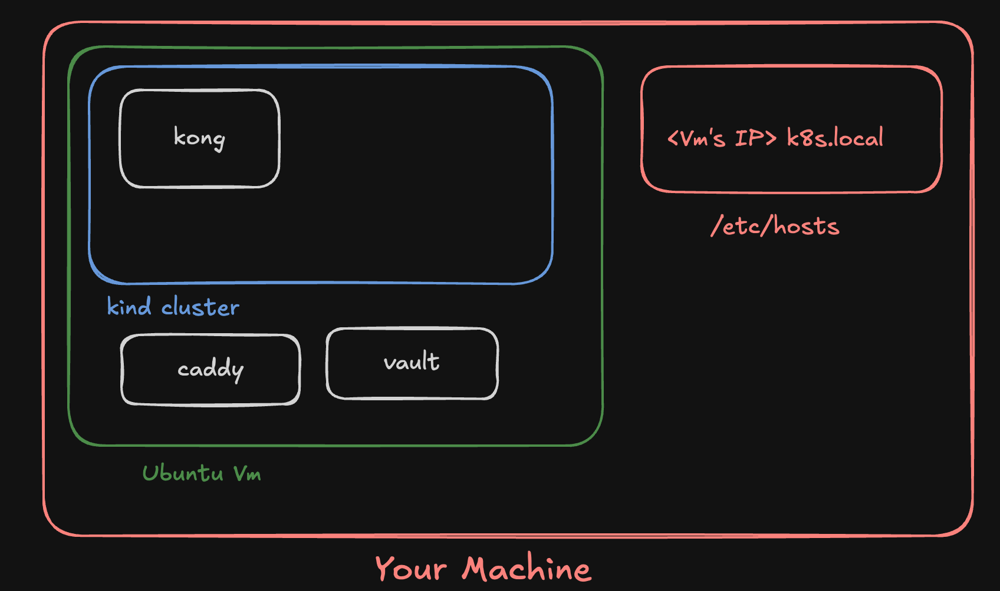
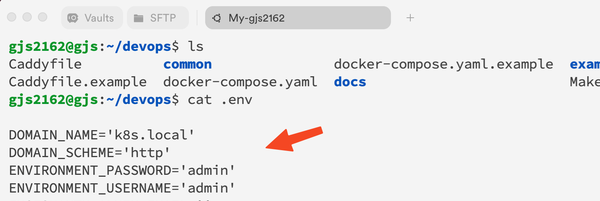
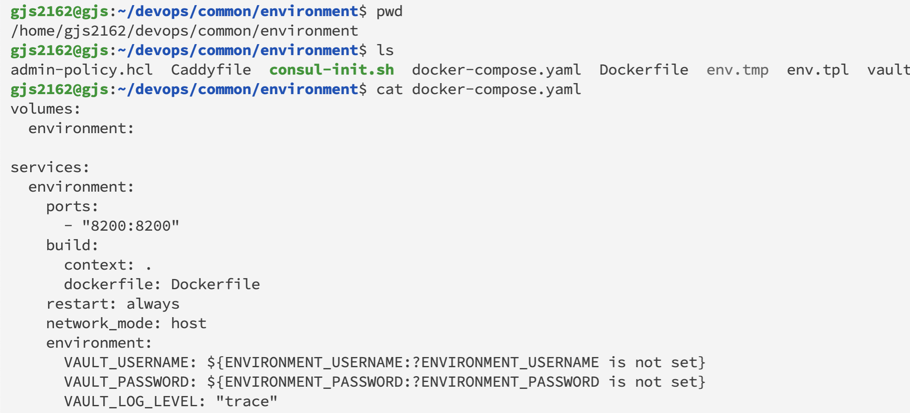
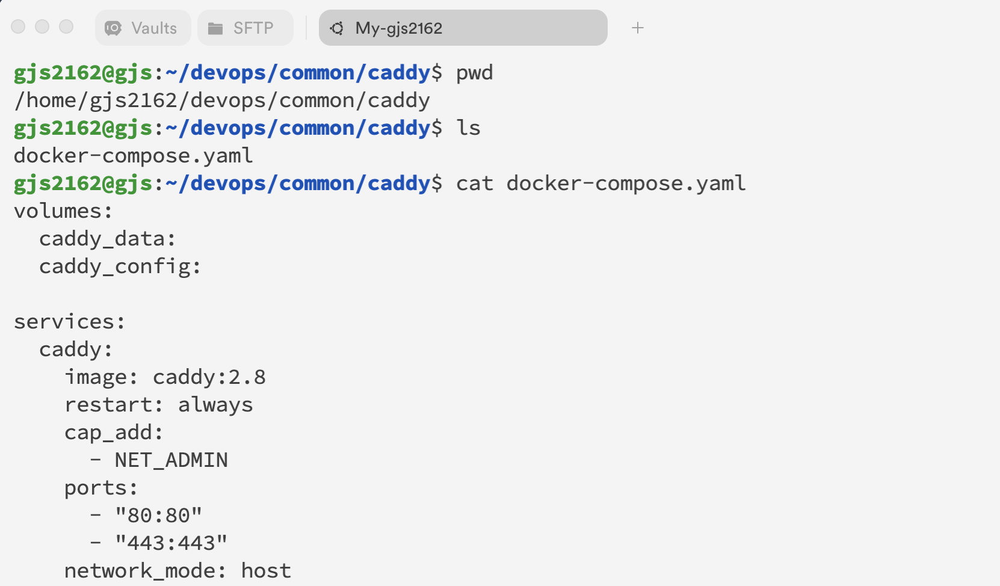
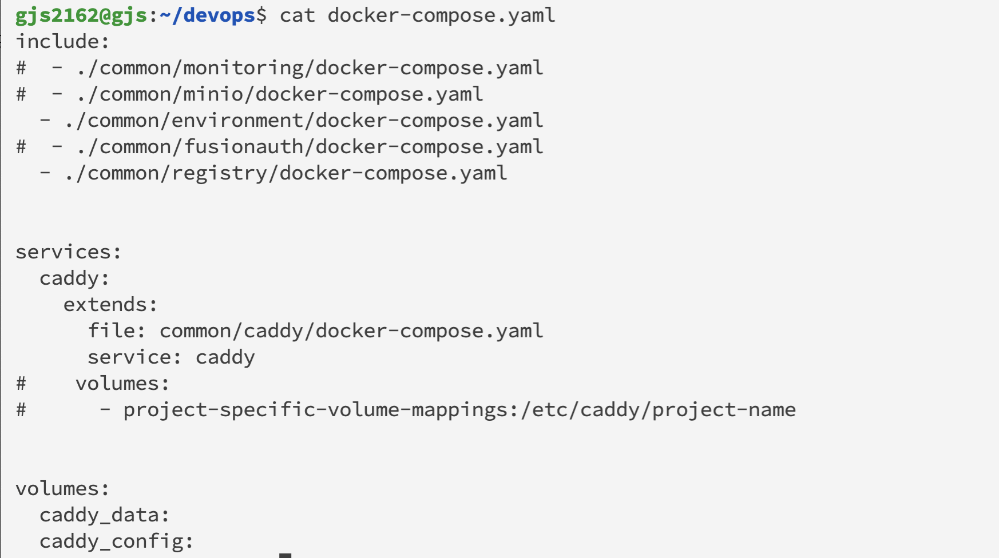
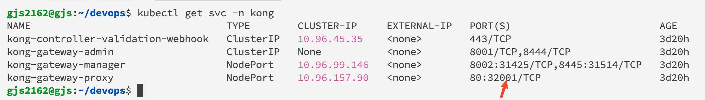
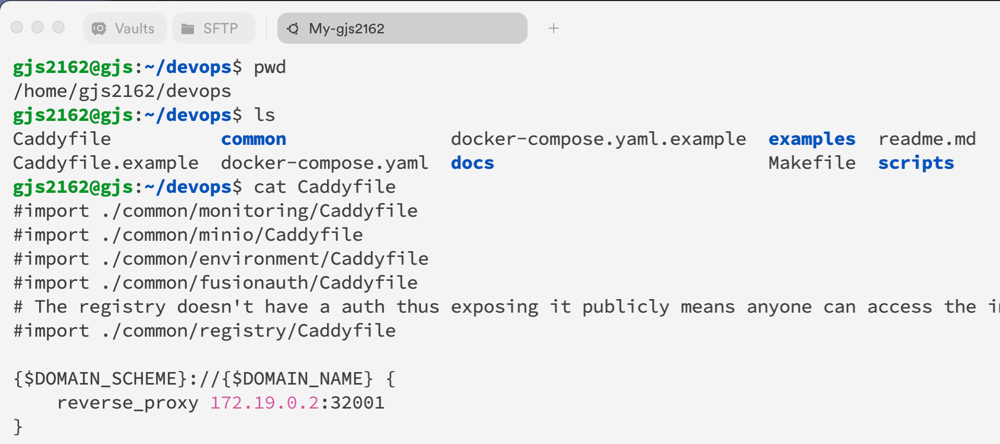
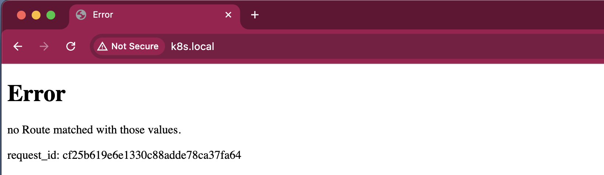

# Overview




In the following steps, you will:

- **Create a Virtual Machine (VM)** on your local system.
- **Install Docker, Vault, and Caddy** on the VM using the provided "devops" repository.
- **Install `kind` and `kubectl`** on your VM, and create a Kubernetes cluster using `kind`.
- **Set up Vault and Kong** in the Kubernetes cluster.

By the end of this process:

- Accessing the configured domain name from your local system will route you to the `kong-gateway-proxy` service within the cluster.
- You will also be able to synchronize secrets from Vault successfully.


## Creating the Virtual Machine (VM)

To create a Virtual Machine (VM), follow these steps based on your operating system:

- **macOS:** Use [UTM](https://mac.getutm.app/) to create the VM.
- **Windows/Linux:** Use [Oracle VM VirtualBox](https://www.oracle.com/in/virtualization/technologies/vm/downloads/virtualbox-downloads.html) or another virtualization tool compatible with your OS.

1. **Download the Ubuntu Image:**
   - Obtain the Ubuntu image for your VM from the following link: [Ubuntu 24.04 Live Server ARM64](https://cdimage.ubuntu.com/releases/24.04/release/ubuntu-24.04-live-server-arm64.iso).

2. **Configure the VM:**
   - After installing Ubuntu, shut down the VM.
   - In your VM settings, create and configure a Bridge network to ensure proper network connectivity for your VM.

Follow the instructions provided by your chosen virtualization tool for creating and configuring the VM with the downloaded image.


## Installing docker, vault and Caddy on Vm:
1. Fork and clone the fork of the following repo to setup docker, vault and caddy: ```https://github.com/Samagra-Development/devops.git``` 
Follow the steps(Upto step 9) under : "Setting up services on VM". 

2. In the .env file add the DOMAIN_NAME, ENVIRONMENT_USERNAME & ENVIRONMENT_PASSWORD :




3. Make the following changes for vault's docker-compose.yaml(/home/username/devops/common/environment/docker-compose.yaml). Add the ports and the network_mode (**Leave the rest as it is**):




4. Make the following changes for caddy's docker-compose.yaml (/home/username/devops/common/caddy/docker-compose.yaml). Just add the: ```network_mode: host``` (**Leave the rest as it is**) 



Make sure to use the network_mode as "host":```network_mode : host```

5. Only uncomment the service in docker-comopose file which you want to use, like :



Use the ```make deploy```command

## Creating the Cluster Using Kind:

1. [Install kind on your local machine](https://kind.sigs.k8s.io/docs/user/quick-start/)
2. [Install kubectl on local](https://kubernetes.io/docs/tasks/tools/)
3. [Install Helm on local machine](https://helm.sh/docs/intro/install/#from-apt-debianubuntu)
4. Use the `docs/local-cluster/cluster-config.yaml` file of this repository for creating the cluster.
5. Create the cluster using the following command:  
   ```kind create cluster --name <Name for the cluster> --config ./cluster-config.yaml```


## Setting up vault :

Follow this : [Setting up Vault](../../cluster/components/vault/README.md)
(You will find all the necessary files at the same level as the README.md in this repo.)

Make sure :
1. In vault-values.yaml: ```
address: "http://<VM's IP>:<Vault's port, eg 
: 8200>"```  eg : ```"http://192.168.64.1:8200```

   - To get ip address of VM, type : ```ip a```
2. To Go to the Vault's UI using <VM's IP>:8200 and In Secrets Engine "kv" create a secret called "sample-secret" with a key eg : a with value b
3. Make changes accordingly in this command(Step 10th) :```vault write auth/kubernetes/config token_reviewer_jwt="$jwt" kubernetes_host="https://<Node's Internal IP>:6443" kubernetes_ca_cert="$cert" ```
4. To get INTERNAL_IP of node type : ```kubectl get nodes -o wide```

## Setting up kong :

Follow this to setup kong : [Setting up kong](../../cluster/components/kong/README.md)
(You will find all the necessary files at the same level as the README.md in this repo.)

At last to check the services, type : ```kubectl get svc -n kong```




# Configure Caddy and Reload it: 

1. Cd into the devops repository which you used to setup Caddy.
2. Configure the Caddy file at root level. Use the Node's Internal IP. 



```
#import ./common/monitoring/Caddyfile
#import ./common/minio/Caddyfile
#import ./common/environment/Caddyfile
#import ./common/fusionauth/Caddyfile
# The registry doesn't have a auth thus exposing it publicly means anyone can access the images pushed to this registry
#import ./common/registry/Caddyfile

{$DOMAIN_SCHEME}://{$DOMAIN_NAME} {
    reverse_proxy <Nodes's Internal IP>:32001
}
```

3. Go to your Local machine's /etc/hosts file and add eg : ```192.168.64.1 k8s.local``` 
4. On VM To reload Caddy type :```make down``` then ```make deploy```
5. Now when you will hit ```k8s.local``` from local machine's browser the you should get something like below: 

